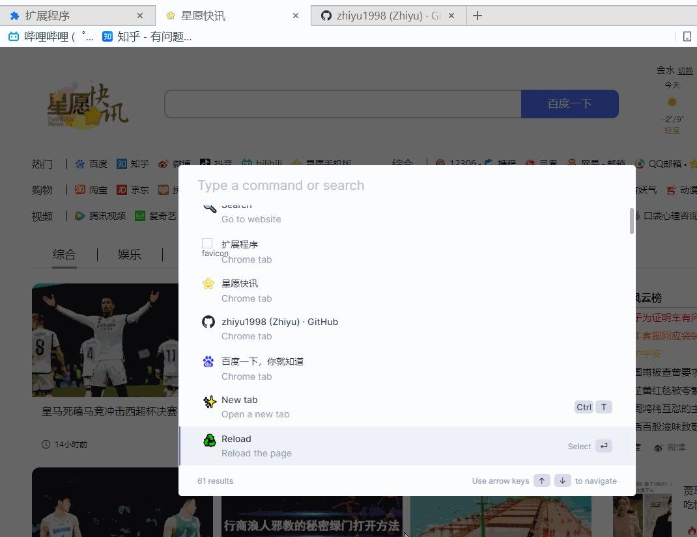

 
    

 <h1>Oh! Mini!  - Bookmark, History, Tab Manager</h1>

[中文] [\[English\]](./docs/README-EN.md) 

基于 [Omni](https://github.com/alyssaxuu/omni) 重构 TS & React 开发的 Chrome 插件页内搜索效率工具

## 功能展示

## 功能 && 待办
- [x] 书签搜索
- [x] 历史记录搜索
- [x] 标签搜索
- [ ] 基于Google、Bing搜索引擎的网页搜索
- [ ] AI搜索
- ...

## 开发流程
1. 安装依赖
> yarn

2. 构建Dist
> yarn build

3. 加载插件
> chrome://extensions/ -> Load unpacked -> select `dist` folder

## 感谢以下仓库的开源
- [Chrome Dev](https://developer.chrome.com/docs/extensions/get-started/tutorial/hello-world?hl=zh-cn)
- [Omni](https://github.com/alyssaxuu/omni)

## 声明
此项目只发布于 GitHub，基于 MIT 协议，免费且作为开源学习使用。并且不会有任何形式的卖号、付费服务、讨论群、讨论组等行为。谨防受骗。
